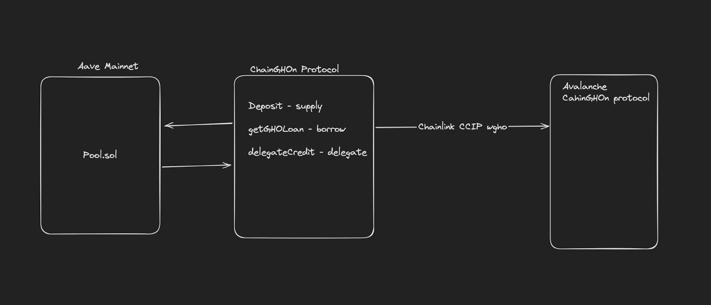

# ChainGHOn

## Ethereum Smart Contract Address

[https://sepolia.etherscan.io/address/0xa1df6b89889ad52b0d9b50a88b7f3a712edd08ad](https://sepolia.etherscan.io/address/0xa1df6b89889ad52b0d9b50a88b7f3a712edd08ad)

## Avax Smart Contract Address
[https://testnet.snowtrace.io/address/0x1c9cd467904112411923aba74bda71a772b009bb](https://testnet.snowtrace.io/address/0x1c9cd467904112411923aba74bda71a772b009bb)
[https://testnet.snowtrace.io/address/0x8f60ab69c721aafa7126b41c8b4067d13dae0b6d](https://testnet.snowtrace.io/address/0x8f60ab69c721aafa7126b41c8b4067d13dae0b6d)

[Check presentation](./ChainGHOn!.pdf)